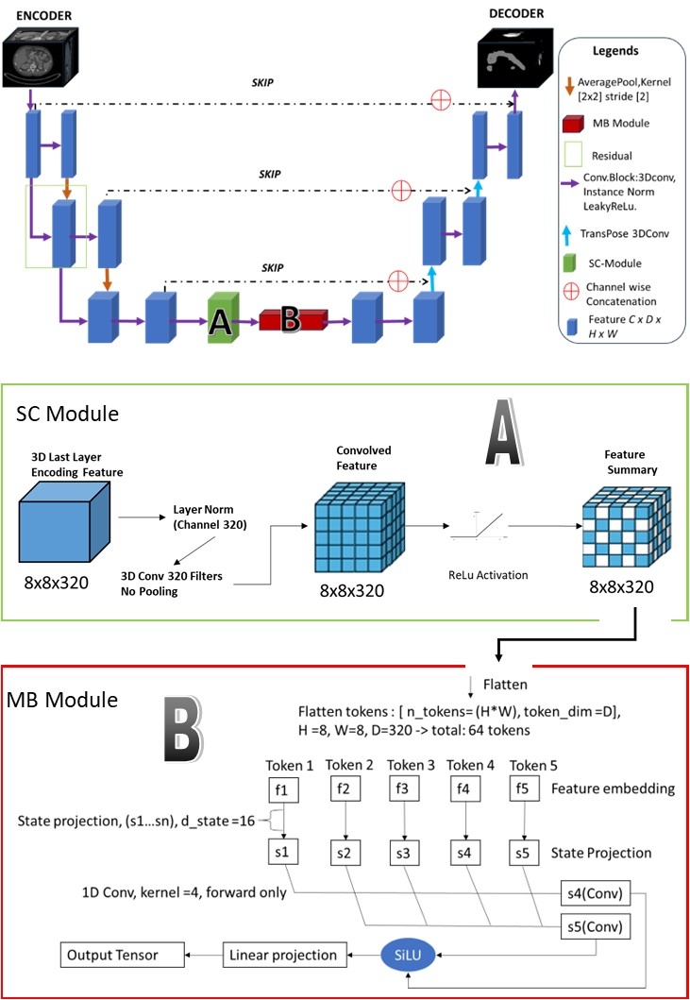

# 3D-SCUMamba
Official repository for3D-SCUMamba: An Abdominal Tumor Segmentation model

<div align="center">


</div>

<p align="center" style="font-size: larger;">
  
</p>




## Dataset
The datasets used to evaluate 3D-SCU Mamba can be accessed via the following link:

#### MSD Pancreas Dataset – Task 10 (Colon Cancer) and Task 07 (Pancreas):
https://drive.google.com/drive/folders/1HqEgzS8BV2c7xYNrZdEAnrHk7osJJ--2

#### Synapse BTCV tumor Dataset:
https://www.synapse.org/Synapse:syn3193805/files/. 
The dataset used to test 3D-SCUMAMBA is accessible at \href{https://www.synapse.org/#!Synapse:syn3193805/wiki/89480}

## Dataset Preparation
3D-SCU follows the preprocessing and training scenarios provided by the nnU-Net framework.
We gratefully acknowledge and credit the nnU-Net framework.
For dataset preparation details, we kindly refer readers to the original nnU-Net documentation.


## To install and run the Mamba procedure, we gratefully acknowledge the work by Bowang Lab.
Please follow the installation instructions provided in their repository and ensure that all dependencies are properly fulfilled [here](https://github.com/bowang-lab/U-Mamba)


Requirements: `Ubuntu 20.04`, `CUDA 11.8`

1. Create a virtual environment: `conda create -n 3dscu python=3.10 -y` and `conda activate 3dscu `
2. Install [Pytorch](https://pytorch.org/get-started/previous-versions/#linux-and-windows-4) 2.0.1: `pip install torch==2.0.1 torchvision==0.15.2 --index-url https://download.pytorch.org/whl/cu118`
3. Install [Mamba](https://github.com/state-spaces/mamba): `pip install causal-conv1d>=1.2.0` and `pip install mamba-ssm --no-cache-dir`
4. Download code: `git clone https://github.com/juwita-sj/3DSCU`
5. `cd 3dscu/3dscu` and run `pip install -e .`


sanity test: Enter python command-line interface and run

```bash
import torch
import mamba_ssm
```


## Model Training
Download dataset from `data` folder. 3DSCU-Mamba is built on the popular [nnU-Net](https://github.com/MIC-DKFZ/nnUNet) framework. If you want to train 3DSCU-Mamba on your own dataset, please follow this [guideline](https://github.com/MIC-DKFZ/nnUNet/blob/master/documentation/dataset_format.md) to prepare the dataset. 

### Preprocessing

```bash
nnUNetv2_plan_and_preprocess -d DATASET_ID --verify_dataset_integrity
```

### Train 3D models

- Train 3D `3dSCU` model

```bash
nnUNetv2_train DATASET_ID 3d_lowres all -tr nnUNetTrainerU3DST
```


## Inference

- Predict testing cases with `3DSCU` model

```bash
nnUNetv2_predict -i INPUT_FOLDER -o OUTPUT_FOLDER -d DATASET_ID -c CONFIGURATION -f all -tr nnUNetTrainerU3DST --disable_tta
```


## Acknowledgements

We thank the authors of [nnU-Net](https://github.com/MIC-DKFZ/nnUNet) and [U-Mamba](https://github.com/bowang-lab/U-Mamba) for making their valuable code publicly available.


